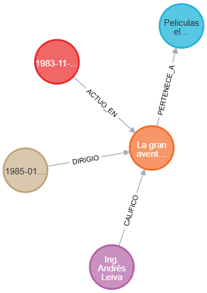

# RecomendaDB — Neo4j Movie Recommender

Motor de recomendación de películas sobre Neo4j. Modela las relaciones entre usuarios, películas, actores, directores y géneros como un grafo, aprovechando traversals para generar recomendaciones basadas en la red social del usuario.

Incluye análisis de grados de separación con `shortestPath` (BFS), detección de géneros favoritos por patrones de calificación, y consultas de popularidad por género.



## Tecnologías

| Componente | Tecnología |
|---|---|
| Base de datos | Neo4j 5.18 |
| Plugins | APOC |
| Contenedores | Docker + docker-compose |
| Scripts | Python 3.11 |
| Driver | neo4j (Python) |
| Datos ficticios | Faker |

## Modelo de grafos

El modelo tiene 5 tipos de nodos y 7 tipos de relaciones:

```
(Usuario)-[:CALIFICO {puntuacion, fecha, comentario}]->(Pelicula)
(Usuario)-[:VIO {fecha_visualizacion, completo}]->(Pelicula)
(Usuario)-[:ES_AMIGO_DE {fecha_amistad}]->(Usuario)
(Usuario)-[:LE_GUSTA {nivel_interes}]->(Genero)
(Pelicula)-[:PERTENECE_A]->(Genero)
(Actor)-[:ACTUO_EN {personaje}]->(Pelicula)
(Director)-[:DIRIGIO]->(Pelicula)
```

### Volumen de datos

| Entidad | Cantidad |
|---|---|
| Usuarios | 500 |
| Películas | 200 |
| Actores | 100 |
| Directores | 50 |
| Géneros | 15 |
| Calificaciones | 4,614 |
| Visualizaciones | 6,094 |
| Amistades | 2,534 |

## Instalación

### Requisitos

- Docker Desktop 4.x
- Python 3.10+

### Levantar Neo4j

```bash
docker compose up -d
```

Neo4j Browser disponible en `http://localhost:7474` (usuario: `neo4j`, contraseña: `peliculas123`).

### Crear constraints

Ejecutar en Neo4j Browser el contenido de `scripts/schema.cypher`, o usar:

```bash
cat scripts/schema.cypher | docker exec -i neo4j-peliculas cypher-shell -u neo4j -p peliculas123
```

### Cargar datos

```bash
pip install -r requirements.txt
python scripts/carga_datos.py
```

Genera los 12 archivos CSV en `data/` y los carga en Neo4j con `LOAD CSV` y `MERGE`.

## Consultas

### Películas bien calificadas por un usuario

```cypher
MATCH (u:Usuario)-[c:CALIFICO]->(p:Pelicula)
WHERE u.email = 'nayeliroldan@example.com' AND c.puntuacion > 4
RETURN p.titulo, c.puntuacion, c.fecha, c.comentario
ORDER BY c.puntuacion DESC
```

### Películas de amigos que no has visto

```cypher
MATCH (u:Usuario)-[:ES_AMIGO_DE]-(amigo:Usuario)-[:VIO]->(p:Pelicula)
WHERE u.email = 'nayeliroldan@example.com'
AND NOT (u)-[:VIO]->(p)
RETURN DISTINCT p.titulo, p.anio, p.duracion
LIMIT 10
```

### Ruta más corta entre dos usuarios

```cypher
MATCH (u1:Usuario {email: 'nayeliroldan@example.com'}),
      (u2:Usuario {email: 'abelardoalcala@example.com'})
MATCH path = shortestPath((u1)-[:ES_AMIGO_DE*]-(u2))
RETURN [n IN nodes(path) | n.nombre] as ruta,
       length(path) as grados_de_separacion
```

### Recomendación social

```cypher
MATCH (u:Usuario {email: 'nayeliroldan@example.com'})-[:ES_AMIGO_DE]-(amigo:Usuario)-[c:CALIFICO]->(p:Pelicula)
WHERE c.puntuacion >= 4
AND NOT (u)-[:VIO]->(p)
AND NOT (u)-[:CALIFICO]->(p)
RETURN p.titulo,
       avg(c.puntuacion) as puntuacion_amigos,
       count(amigo) as amigos_que_la_vieron
ORDER BY puntuacion_amigos DESC, amigos_que_la_vieron DESC
LIMIT 10
```

Las 6 consultas completas están en `scripts/`.

## Estructura del proyecto

```
├── docker-compose.yml          # Neo4j 5.18 + APOC
├── requirements.txt            # Dependencias Python
├── scripts/
│   ├── schema.cypher           # Constraints de unicidad
│   ├── carga_datos.py          # Generación de CSVs + carga en Neo4j
│   ├── consulta1_peliculas_bien_calificadas.cypher
│   ├── consulta2_peliculas_amigos_no_vistas.cypher
│   ├── consulta3_promedio_calificaciones.cypher
│   ├── consulta4_generos_favoritos.cypher
│   ├── consulta5_ruta_mas_corta.cypher
│   └── consulta6_populares_por_genero.cypher
├── data/                       # 12 archivos CSV con datos de ejemplo
├── docs/
│   └── Documentacion.md        # Documentación técnica completa
└── images/
    └── graph-model.png         # Visualización del modelo de grafos
```

## Documentación

- [Documentación Técnica](docs/Documentacion.md) — Modelo de grafos, consultas Cypher, análisis de redes y sistema de recomendación

## Autor

**Pablo Alejandro Marroquin Cutz**
