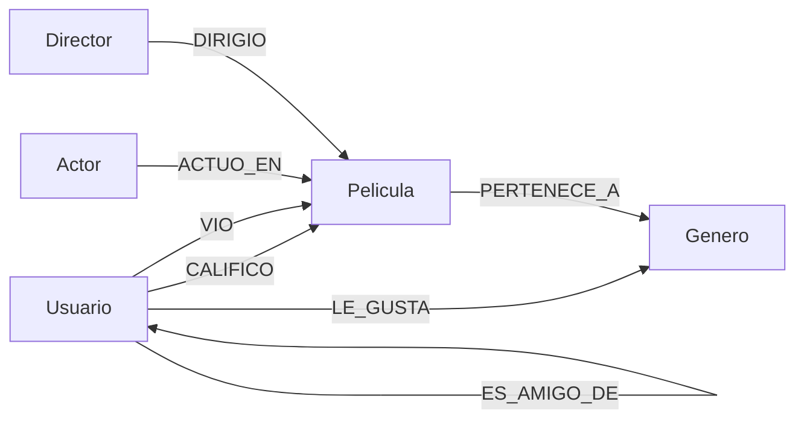

# Documentacion Tecnica: Sistema de Recomendacion de Peliculas
## Base de Datos de Grafos con Neo4j

**Universidad San Carlos de Guatemala**
**Facultad de Ingenieria — Ingenieria en Ciencias y Sistemas**
**Sistemas de Bases de Datos 2 — Primer Semestre 2026**

| Campo | Detalle |
|---|---|
| Estudiante | Pablo Alejandro Marroquin Cutz |
| Carnet | 202200214 |
| Proyecto | Proyecto 2 — RecomendaDB |
| Fecha | Abril 2026 |

---

## Tabla de Contenidos

1. [Resumen del sistema](#1-resumen-del-sistema)
2. [Por que Neo4j para este problema](#2-por-que-neo4j-para-este-problema)
3. [Modelo conceptual de grafos](#3-modelo-conceptual-de-grafos)
4. [Descripcion de nodos y propiedades](#4-descripcion-de-nodos-y-propiedades)
5. [Descripcion de relaciones y propiedades](#5-descripcion-de-relaciones-y-propiedades)
6. [Implementacion del esquema](#6-implementacion-del-esquema)
7. [Carga masiva de datos](#7-carga-masiva-de-datos)
8. [Consultas Cypher implementadas](#8-consultas-cypher-implementadas)
9. [Analisis de redes y algoritmos](#9-analisis-de-redes-y-algoritmos)
10. [Sistema de recomendacion](#10-sistema-de-recomendacion)
11. [Conclusiones](#11-conclusiones)

---

## 1. Resumen del sistema

RecomendaDB es un sistema de recomendacion de peliculas implementado sobre Neo4j, una base de datos de grafos. El sistema modela las relaciones entre usuarios, peliculas, generos, actores y directores, aprovechando la naturaleza conectada de los datos para generar recomendaciones personalizadas basadas en las conexiones sociales y preferencias de los usuarios.

**Volumen de datos:**

| Entidad | Cantidad |
|---|---|
| Usuarios | 500 |
| Peliculas | 200 |
| Actores | 100 |
| Directores | 50 |
| Generos | 15 |
| Calificaciones | 4,614 |
| Visualizaciones | 6,094 |
| Amistades | 2,534 |
| Preferencias de genero | 1,757 |

---

## 2. Por que Neo4j para este problema

Las bases de datos relacionales tradicionales requieren multiples JOINs para responder preguntas como "que peliculas vieron los amigos de mis amigos que yo no he visto". En SQL esto implica combinar varias tablas con JOINs anidados cuyo rendimiento se degrada exponencialmente con el volumen de datos.

Neo4j resuelve este problema de forma natural porque los datos se almacenan exactamente como se conceptualizan: nodos conectados por relaciones. Atravesar conexiones en un grafo es una operacion de tiempo constante por salto, independientemente del tamano total de la base de datos. Esto hace que las consultas de recomendacion, rutas mas cortas y analisis de redes sean eficientes incluso con millones de nodos.

**Comparacion directa:**

| Operacion | SQL | Neo4j |
|---|---|---|
| Historial de usuario | SELECT con JOIN | MATCH directo por nodo |
| Peliculas de amigos | 3 JOINs anidados | Un patron de 2 saltos |
| Ruta mas corta | Algoritmo externo complejo | shortestPath() nativo |
| Recomendacion social | Multiples subconsultas | Un patron de traversal |

---

## 3. Modelo conceptual de grafos

El modelo tiene 5 tipos de nodos y 7 tipos de relaciones:

```
(Usuario)-[:CALIFICO {puntuacion, fecha, comentario}]->(Pelicula)
(Usuario)-[:VIO {fecha_visualizacion, completo}]->(Pelicula)
(Usuario)-[:ES_AMIGO_DE {fecha_amistad}]->(Usuario)
(Usuario)-[:LE_GUSTA {nivel_interes}]->(Genero)
(Pelicula)-[:PERTENECE_A]->(Genero)
(Actor)-[:ACTUO_EN {personaje}]->(Pelicula)
(Director)-[:DIRIGIO]->(Pelicula)
```

### Diagrama del modelo



---

## 4. Descripcion de nodos y propiedades

### Usuario
Representa a una persona registrada en la plataforma.

| Propiedad | Tipo | Descripcion |
|---|---|---|
| nombre | String | Nombre completo del usuario |
| email | String | Correo electronico, unico en el sistema |
| edad | Integer | Edad en anos |
| pais | String | Pais de residencia |

### Pelicula
Contenido cinematografico disponible en la plataforma.

| Propiedad | Tipo | Descripcion |
|---|---|---|
| titulo | String | Titulo de la pelicula, unico en el sistema |
| anio | Integer | Ano de lanzamiento |
| duracion | Integer | Duracion en minutos |
| sinopsis | String | Descripcion breve del contenido |

### Genero
Categoria cinematografica a la que pertenece una pelicula.

| Propiedad | Tipo | Descripcion |
|---|---|---|
| nombre | String | Nombre del genero, unico en el sistema |
| descripcion | String | Descripcion del tipo de contenido |

### Actor
Persona que actua en una o mas peliculas.

| Propiedad | Tipo | Descripcion |
|---|---|---|
| nombre | String | Nombre completo del actor, unico |
| fecha_nacimiento | String | Fecha de nacimiento |
| nacionalidad | String | Pais de origen |

### Director
Persona que dirige una o mas peliculas.

| Propiedad | Tipo | Descripcion |
|---|---|---|
| nombre | String | Nombre completo del director, unico |
| fecha_nacimiento | String | Fecha de nacimiento |
| nacionalidad | String | Pais de origen |

---

## 5. Descripcion de relaciones y propiedades

### CALIFICO
Un usuario califica una pelicula con una puntuacion del 1 al 5.

| Propiedad | Tipo | Descripcion |
|---|---|---|
| puntuacion | Integer | Calificacion del 1 al 5 estrellas |
| fecha | String | Fecha en que se hizo la calificacion |
| comentario | String | Comentario opcional del usuario |

### VIO
Un usuario visualizo una pelicula.

| Propiedad | Tipo | Descripcion |
|---|---|---|
| fecha_visualizacion | String | Fecha en que se vio la pelicula |
| completo | Boolean | Si el usuario termino de ver la pelicula |

### ES_AMIGO_DE
Relacion de amistad entre dos usuarios. Es bidireccional, se consulta en ambas direcciones con `(u)-[:ES_AMIGO_DE]-(amigo)`.

| Propiedad | Tipo | Descripcion |
|---|---|---|
| fecha_amistad | String | Fecha en que se establecio la amistad |

### LE_GUSTA
Un usuario tiene preferencia por un genero cinematografico.

| Propiedad | Tipo | Descripcion |
|---|---|---|
| nivel_interes | Integer | Nivel de interes del 1 al 5 |

### PERTENECE_A
Una pelicula pertenece a uno o mas generos. Sin propiedades adicionales.

### ACTUO_EN
Un actor participo en una pelicula interpretando un personaje.

| Propiedad | Tipo | Descripcion |
|---|---|---|
| personaje | String | Nombre del personaje interpretado |

### DIRIGIO
Un director dirigio una pelicula. Sin propiedades adicionales.

---

## 6. Implementacion del esquema

### Constraints de unicidad

Los constraints garantizan que no existan nodos duplicados y aceleran las busquedas:

```cypher
CREATE CONSTRAINT usuario_email IF NOT EXISTS
FOR (u:Usuario) REQUIRE u.email IS UNIQUE;

CREATE CONSTRAINT pelicula_titulo IF NOT EXISTS
FOR (p:Pelicula) REQUIRE p.titulo IS UNIQUE;

CREATE CONSTRAINT genero_nombre IF NOT EXISTS
FOR (g:Genero) REQUIRE g.nombre IS UNIQUE;

CREATE CONSTRAINT actor_nombre IF NOT EXISTS
FOR (a:Actor) REQUIRE a.nombre IS UNIQUE;

CREATE CONSTRAINT director_nombre IF NOT EXISTS
FOR (d:Director) REQUIRE d.nombre IS UNIQUE;
```

Los constraints en Neo4j crean automaticamente un indice sobre la propiedad especificada, lo que mejora el rendimiento de las consultas MATCH y MERGE que buscan por esa propiedad.

---

## 7. Carga masiva de datos

La carga se realizo en dos fases. Primero un script Python genera los archivos CSV con datos ficticios usando la libreria Faker. Luego el mismo script usa el driver oficial de Neo4j para ejecutar comandos LOAD CSV que insertan los datos en la base de datos.

### Archivos CSV generados

| Archivo | Contenido |
|---|---|
| usuarios.csv | 500 usuarios con nombre, email, edad y pais |
| peliculas.csv | 200 peliculas con titulo, anio, duracion y sinopsis |
| actores.csv | 100 actores con nombre, fecha de nacimiento y nacionalidad |
| directores.csv | 50 directores con nombre, fecha de nacimiento y nacionalidad |
| generos.csv | 15 generos con nombre y descripcion |
| pelicula_genero.csv | Relaciones pelicula-genero |
| actor_pelicula.csv | Relaciones actor-pelicula con nombre de personaje |
| director_pelicula.csv | Relaciones director-pelicula |
| calificaciones.csv | Relaciones usuario-pelicula con puntuacion, fecha y comentario |
| vistas.csv | Relaciones usuario-pelicula con fecha y si completo |
| amistades.csv | Relaciones usuario-usuario con fecha de amistad |
| le_gusta.csv | Relaciones usuario-genero con nivel de interes |

### Estrategia MERGE

Se uso MERGE en lugar de CREATE para todos los nodos y relaciones. MERGE verifica si el patron ya existe antes de crearlo, evitando duplicados aunque el script se ejecute multiples veces:

```cypher
LOAD CSV WITH HEADERS FROM 'file:///usuarios.csv' AS row
MERGE (u:Usuario {email: row.email})
SET u.nombre = row.nombre,
    u.edad = toInteger(row.edad),
    u.pais = row.pais
```

### Ejemplo de carga de relacion con propiedades

```cypher
LOAD CSV WITH HEADERS FROM 'file:///calificaciones.csv' AS row
MATCH (u:Usuario {email: row.email})
MATCH (p:Pelicula {titulo: row.titulo})
MERGE (u)-[r:CALIFICO {fecha: row.fecha}]->(p)
SET r.puntuacion = toInteger(row.puntuacion),
    r.comentario = row.comentario
```

---

## 8. Consultas Cypher implementadas

### Consulta 1: Peliculas calificadas por un usuario con puntuacion mayor a 4

**Proposito:** Ver las peliculas que un usuario califico favorablemente.

```cypher
MATCH (u:Usuario)-[c:CALIFICO]->(p:Pelicula)
WHERE u.email = 'nayeliroldan@example.com' AND c.puntuacion > 4
RETURN p.titulo, c.puntuacion, c.fecha, c.comentario
ORDER BY c.puntuacion DESC
```

**Resultado de ejemplo:**

| p.titulo | c.puntuacion | c.fecha | c.comentario |
|---|---|---|---|
| La batalla final | 5 | 2024-09-21 | Suscipit quis nam veritatis... |

---

### Consulta 2: Peliculas que vieron los amigos pero el usuario no ha visto

**Proposito:** Base del sistema de recomendacion social. Encuentra contenido nuevo basado en la red de amigos.

```cypher
MATCH (u:Usuario)-[:ES_AMIGO_DE]-(amigo:Usuario)-[:VIO]->(p:Pelicula)
WHERE u.email = 'nayeliroldan@example.com'
AND NOT (u)-[:VIO]->(p)
RETURN DISTINCT p.titulo, p.anio, p.duracion
LIMIT 10
```

**Resultado de ejemplo:**

| p.titulo | p.anio | p.duracion |
|---|---|---|
| La tela de arana | 2008 | 118 |
| La segunda oportunidad | 2016 | 108 |
| La persecucion | 2024 | 118 |

El patron `(u)-[:ES_AMIGO_DE]-(amigo)` usa guion en lugar de flecha para ignorar la direccion de la relacion, tratando la amistad como bidireccional.

---

### Consulta 3: Promedio de calificaciones de una pelicula

**Proposito:** Obtener la calificacion promedio y el total de calificaciones de una pelicula especifica.

```cypher
MATCH (u:Usuario)-[c:CALIFICO]->(p:Pelicula)
WHERE p.titulo = 'La batalla final'
RETURN p.titulo, avg(c.puntuacion) as promedio, count(c) as total_calificaciones
```

**Resultado de ejemplo:**

| p.titulo | promedio | total_calificaciones |
|---|---|---|
| La batalla final | 3.52 | 23 |

---

### Consulta 4: Generos favoritos de un usuario basados en sus calificaciones

**Proposito:** Identificar los generos que un usuario prefiere analizando sus patrones de calificacion.

```cypher
MATCH (u:Usuario)-[c:CALIFICO]->(p:Pelicula)-[:PERTENECE_A]->(g:Genero)
WHERE u.email = 'nayeliroldan@example.com'
RETURN g.nombre, avg(c.puntuacion) as promedio, count(c) as peliculas_calificadas
ORDER BY promedio DESC
```

**Resultado de ejemplo:**

| g.nombre | promedio | peliculas_calificadas |
|---|---|---|
| Aventura | 4.0 | 2 |
| Romance | 4.0 | 1 |
| Documental | 3.5 | 2 |
| Accion | 3.0 | 2 |

Esta consulta atraviesa 3 nodos: Usuario -> Pelicula -> Genero, demostrando el poder del traversal de grafos para descubrir patrones indirectos.

---

### Consulta 5: Ruta mas corta entre dos usuarios

**Proposito:** Calcular los grados de separacion entre dos usuarios a traves de su red de amistades.

```cypher
MATCH (u1:Usuario {email: 'nayeliroldan@example.com'}),
      (u2:Usuario {email: 'abelardoalcala@example.com'})
MATCH path = shortestPath((u1)-[:ES_AMIGO_DE*]-(u2))
RETURN [n IN nodes(path) | n.nombre] as ruta,
       length(path) as grados_de_separacion
```

**Resultado de ejemplo:**

| ruta | grados_de_separacion |
|---|---|
| [Cristal Suarez, Judith Cedillo, Lorena Olmos] | 2 |

El resultado indica que hay 2 grados de separacion entre los dos usuarios: estan conectados a traves de un usuario intermediario. La funcion `shortestPath()` usa un algoritmo BFS (Breadth-First Search) internamente para encontrar el camino mas corto.

---

### Consulta 6: Peliculas mas populares de un genero especifico

**Proposito:** Listar las peliculas con mas visualizaciones dentro de un genero para identificar contenido trending.

```cypher
MATCH (u:Usuario)-[:VIO]->(p:Pelicula)-[:PERTENECE_A]->(g:Genero)
WHERE g.nombre = 'Accion'
RETURN p.titulo, count(u) as visualizaciones
ORDER BY visualizaciones DESC
LIMIT 10
```

**Resultado de ejemplo:**

| p.titulo | visualizaciones |
|---|---|
| La mente oscura | 44 |
| Sin nombre | 39 |
| La noche sin fin | 37 |

---

## 9. Analisis de redes y algoritmos

### Analisis 1: Rutas mas cortas entre usuarios (grados de separacion)

Este analisis implementa el concepto de los seis grados de separacion aplicado a la red social de la plataforma. Usando la funcion nativa `shortestPath()` de Neo4j se calcula el camino minimo entre cualquier par de usuarios a traves de sus conexiones de amistad.

```cypher
MATCH (u1:Usuario {email: 'nayeliroldan@example.com'}),
      (u2:Usuario {email: 'abelardoalcala@example.com'})
MATCH path = shortestPath((u1)-[:ES_AMIGO_DE*]-(u2))
RETURN [n IN nodes(path) | n.nombre] as ruta,
       length(path) as grados_de_separacion
```

**Interpretacion del resultado:** Una ruta de longitud 2 significa que los usuarios estan conectados a traves de un amigo en comun. Una ruta de longitud 1 significa amistad directa. Este analisis es util para identificar que tan conectada esta la comunidad y para sugerir nuevas amistades.

**Por que Neo4j es superior aqui:** En una base de datos relacional este calculo requiere una query recursiva con CTEs que se vuelve exponencialmente lenta con cada nivel adicional. Neo4j implementa BFS de forma nativa y optimizada sobre la estructura del grafo.

---

### Analisis 2: Peliculas altamente conectadas

Este analisis identifica las peliculas con mayor cantidad de talento artistico asociado, combinando actores y directores para medir su relevancia en el ecosistema cinematografico del sistema.

```cypher
MATCH (p:Pelicula)
OPTIONAL MATCH (a:Actor)-[:ACTUO_EN]->(p)
OPTIONAL MATCH (d:Director)-[:DIRIGIO]->(p)
RETURN p.titulo,
       count(DISTINCT a) as actores,
       count(DISTINCT d) as directores,
       count(DISTINCT a) + count(DISTINCT d) as conexiones_totales
ORDER BY conexiones_totales DESC
LIMIT 10
```

**Resultado:**

| p.titulo | actores | directores | conexiones_totales |
|---|---|---|---|
| El precio de la gloria | 5 | 1 | 6 |
| La sombra del mal | 5 | 1 | 6 |
| Sin salida | 5 | 1 | 6 |

**Interpretacion:** Las peliculas con mayor numero de actores reconocidos y directores tienen mas conexiones en el grafo, lo que las hace mas descubribles a traves de traversals. Un usuario que sigue a un actor especifico llegara a estas peliculas mas facilmente.

---

## 10. Sistema de recomendacion

La consulta de recomendacion combina la red social del usuario con las calificaciones de sus amigos para sugerir peliculas que el usuario probablemente disfrutara pero todavia no ha visto.

```cypher
MATCH (u:Usuario {email: 'nayeliroldan@example.com'})-[:ES_AMIGO_DE]-(amigo:Usuario)-[c:CALIFICO]->(p:Pelicula)
WHERE c.puntuacion >= 4
AND NOT (u)-[:VIO]->(p)
AND NOT (u)-[:CALIFICO]->(p)
RETURN p.titulo,
       avg(c.puntuacion) as puntuacion_amigos,
       count(amigo) as amigos_que_la_vieron
ORDER BY puntuacion_amigos DESC, amigos_que_la_vieron DESC
LIMIT 10
```

**Resultado de ejemplo:**

| p.titulo | puntuacion_amigos | amigos_que_la_vieron |
|---|---|---|
| El silencio roto | 5.0 | 2 |
| La marca del diablo | 5.0 | 2 |
| El mundo al reves | 5.0 | 1 |

**Logica de la recomendacion:**
- Solo considera peliculas que el usuario no ha visto ni calificado
- Filtra unicamente calificaciones de 4 o 5 estrellas de amigos
- Ordena por puntuacion promedio de amigos y luego por cuantos amigos la vieron
- Las peliculas que aparecen primero son las mas recomendadas por la red social del usuario

---

## 11. Conclusiones

**Modelado natural de relaciones:** Neo4j permite representar las conexiones entre usuarios, peliculas, actores y generos de forma intuitiva y directa. El modelo de grafos refleja exactamente como se conceptualiza el problema, sin necesidad de tablas intermedias ni claves foraneas.

**Eficiencia en consultas de traversal:** Las consultas que atraviesan multiples niveles de relaciones como encontrar peliculas de amigos de amigos son eficientes en Neo4j porque el costo de cada salto es constante. En SQL el mismo patron requiere JOINs recursivos cuyo rendimiento se degrada rapidamente.

**Algoritmos de grafos nativos:** La funcion shortestPath() implementa BFS de forma nativa y optimizada, permitiendo calcular grados de separacion entre usuarios sin codigo adicional. Este tipo de analisis seria muy complejo de implementar en bases de datos relacionales.

**Flexibilidad del modelo:** Agregar nuevos tipos de relaciones o propiedades en Neo4j no requiere alterar un esquema rigido. Se puede enriquecer el modelo con nuevas conexiones sin migraciones complejas.

**Aplicabilidad real:** El patron de recomendacion implementado es equivalente al que usan plataformas como Netflix o Spotify para sugerencias basadas en redes sociales, demostrando que Neo4j es una tecnologia de produccion real para este tipo de problemas.